# Model Context Protocol (MCP): Building Blocks

The Model Context Protocol (MCP) is a standardized way for AI assistants to communicate with tools, data sources, and other services. This document explains MCP's core concepts using visual diagrams to help you understand how it works, step by step, like building with LEGO blocks.

## 1. The Big Picture: Client-Server Architecture

At its core, MCP follows a client-server architecture that connects AI applications with tools and services.

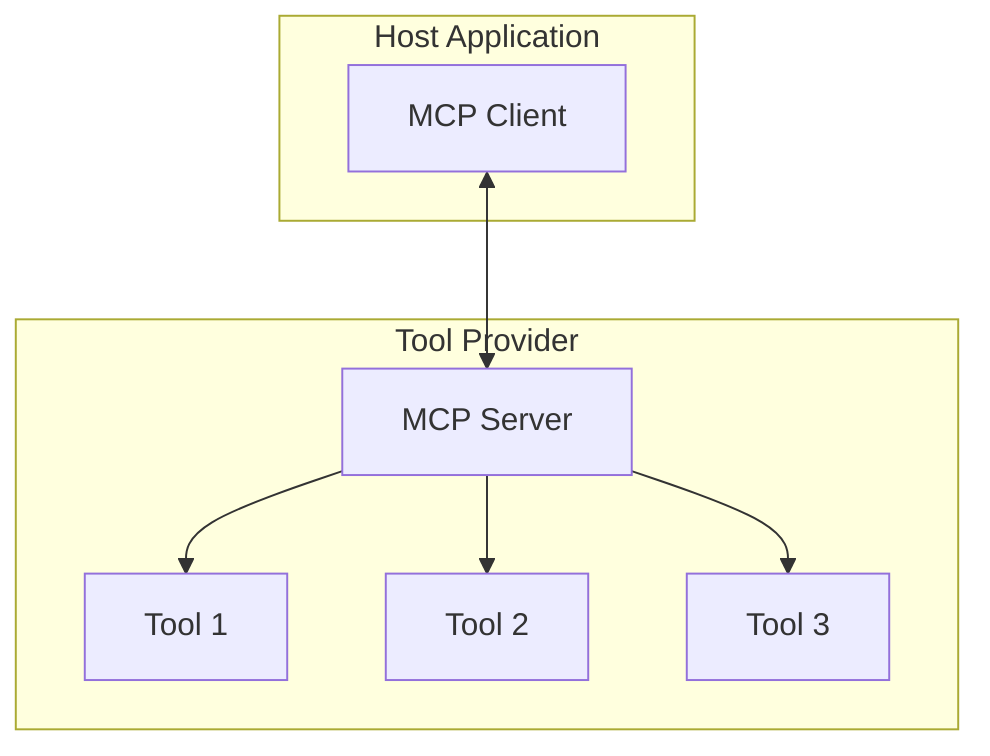

### Key Components:
- **Host**: An application like Claude Desktop or an IDE that initiates connections
- **Client**: Maintains a 1:1 connection with a server, embedded in the host application
- **Server**: Provides tools, context, and capabilities to clients
- **Tools**: Specific functionalities provided by the server (e.g., web search, code execution)

## 2. Building the Connection: Transport Layer

The transport layer is like the foundation of our LEGO tower - it handles the actual communication between clients and servers.

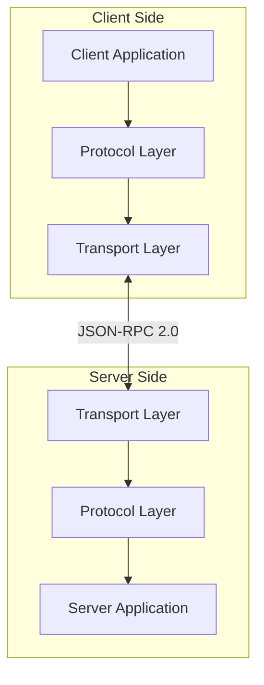

### Transport Types:

#### Stdio Transport (Local Communication)
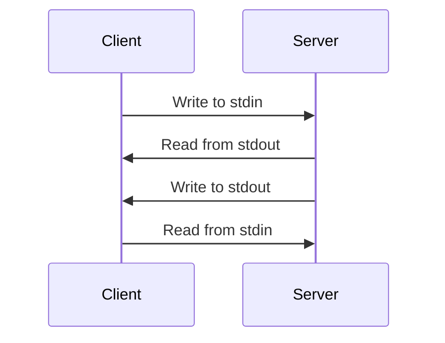

#### SSE Transport (Web Communication)
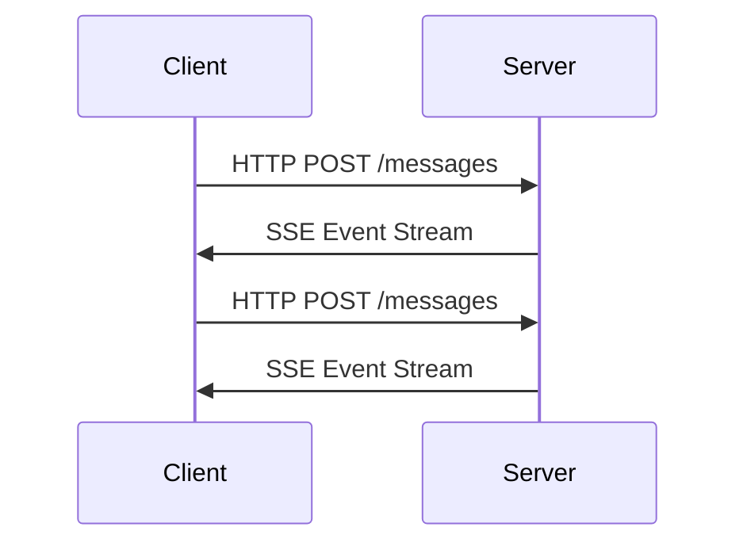

## 3. Speaking the Same Language: Message Format

MCP uses JSON-RPC 2.0 as its message format. Think of these messages as specialized LEGO pieces that fit together in specific ways.

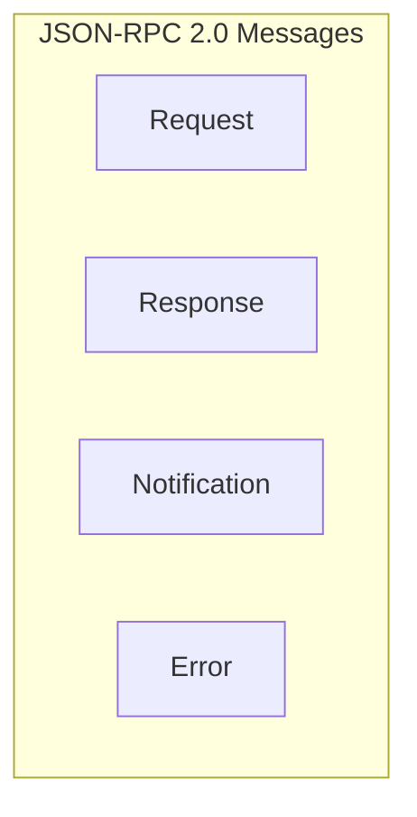

### Message Types:

#### Request (Client → Server or Server → Client)
```json
{
  "jsonrpc": "2.0",
  "id": 1,
  "method": "tool_call",
  "params": {
    "name": "web_search",
    "parameters": {
      "query": "weather in San Francisco"
    }
  }
}
```

#### Response (Success)
```json
{
  "jsonrpc": "2.0",
  "id": 1,
  "result": {
    "temperature": "72°F",
    "conditions": "Partly cloudy"
  }
}
```

#### Response (Error)
```json
{
  "jsonrpc": "2.0",
  "id": 1,
  "error": {
    "code": -32603,
    "message": "Internal error",
    "data": {
      "details": "Search service unavailable"
    }
  }
}
```

#### Notification (One-way message)
```json
{
  "jsonrpc": "2.0",
  "method": "progress",
  "params": {
    "percent": 50,
    "message": "Processing query..."
  }
}
```

## 4. The Connection Lifecycle: Building Our Tower

The MCP connection follows a specific lifecycle, like building a LEGO tower step by step.

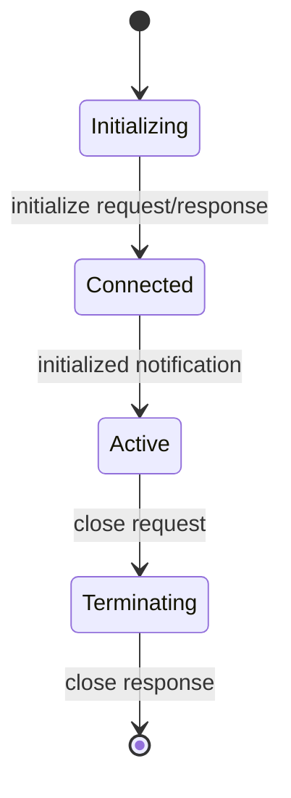

### Step 1: Initialization
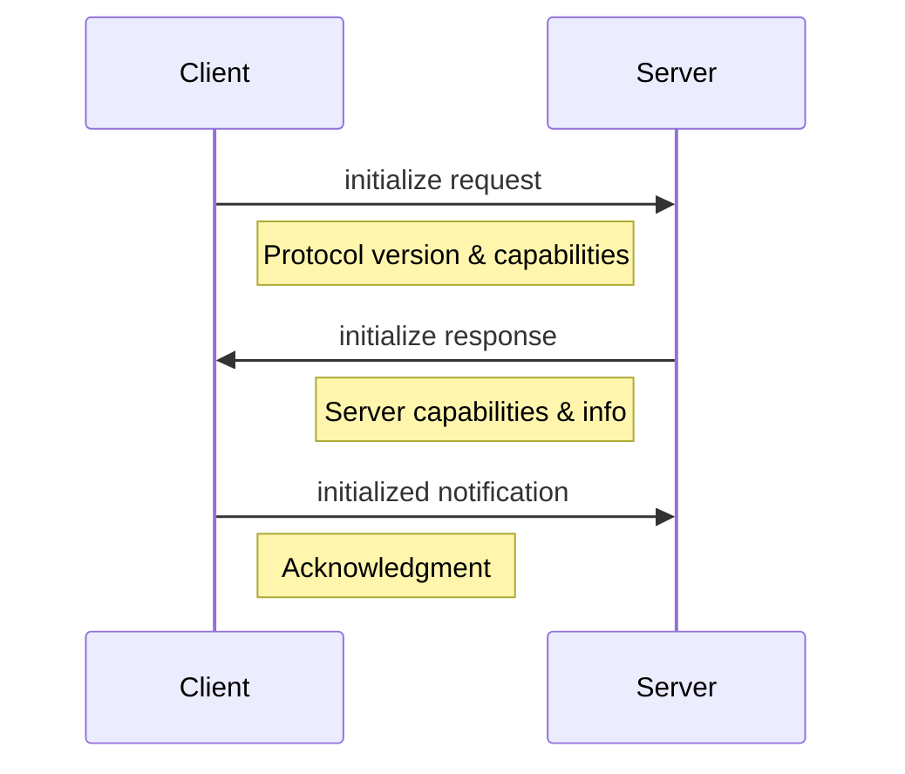

### Step 2: Message Exchange
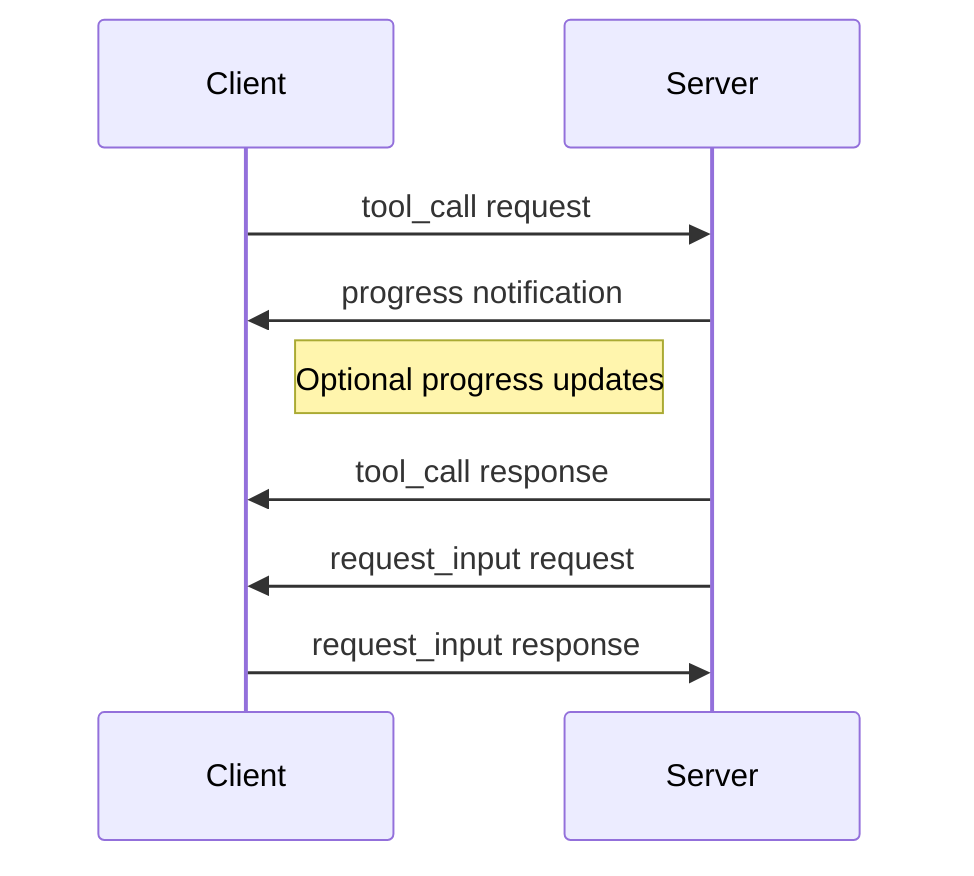

### Step 3: Termination
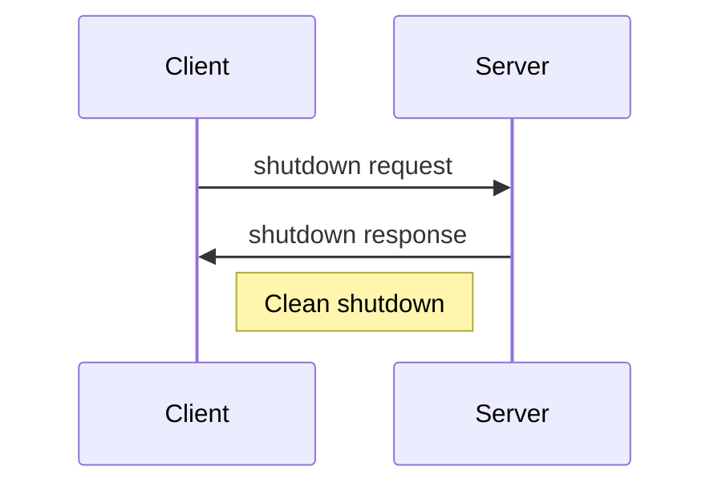

## 5. Tools: The Building Blocks of Functionality

Tools are the functional building blocks that servers provide to clients.

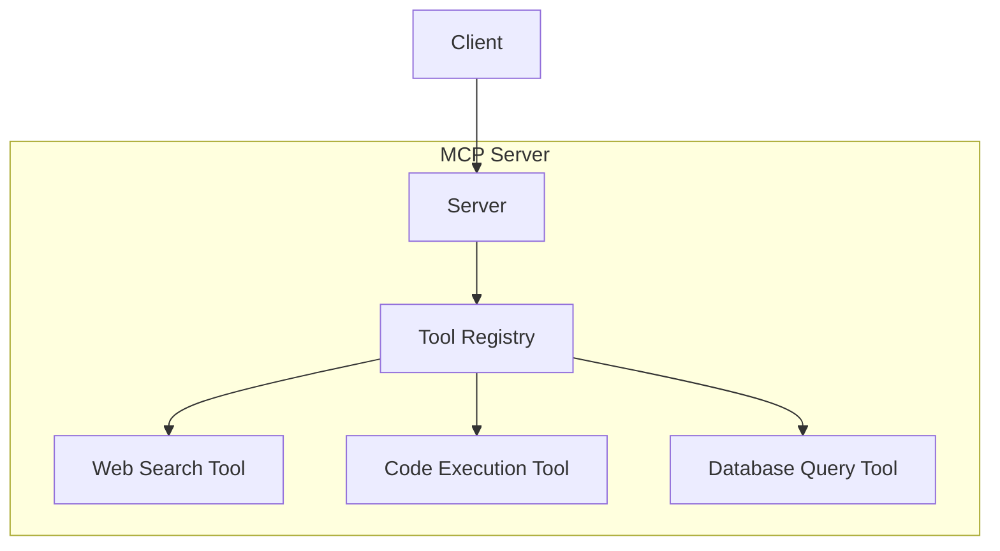

### Tool Definition Example
```json
{
  "name": "web_search",
  "description": "Search the web for information",
  "input_schema": {
    "type": "object",
    "properties": {
      "query": {
        "type": "string",
        "description": "The search query"
      },
      "num_results": {
        "type": "integer",
        "description": "Number of results to return",
        "default": 5
      }
    },
    "required": ["query"]
  }
}
```

## 6. Error Handling: When Blocks Don't Fit

Error handling in MCP is like knowing what to do when LEGO pieces don't fit together properly.

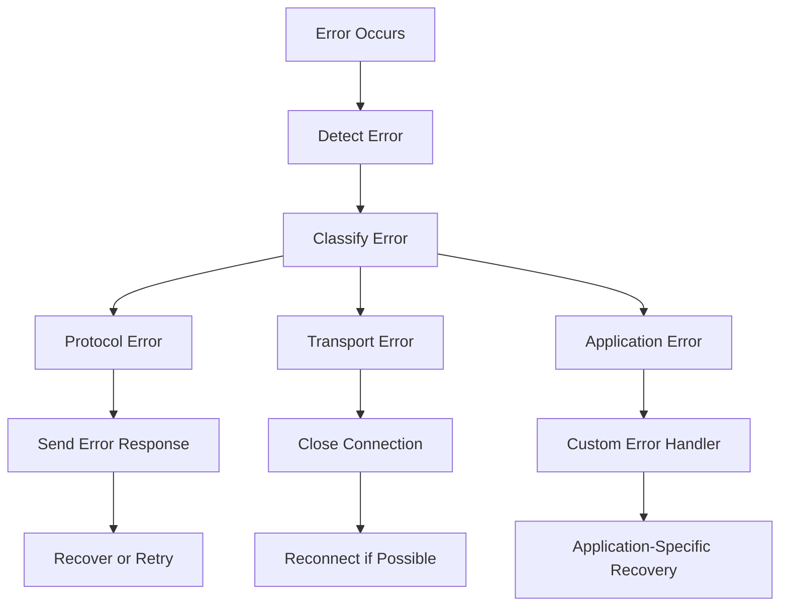

### Standard Error Codes
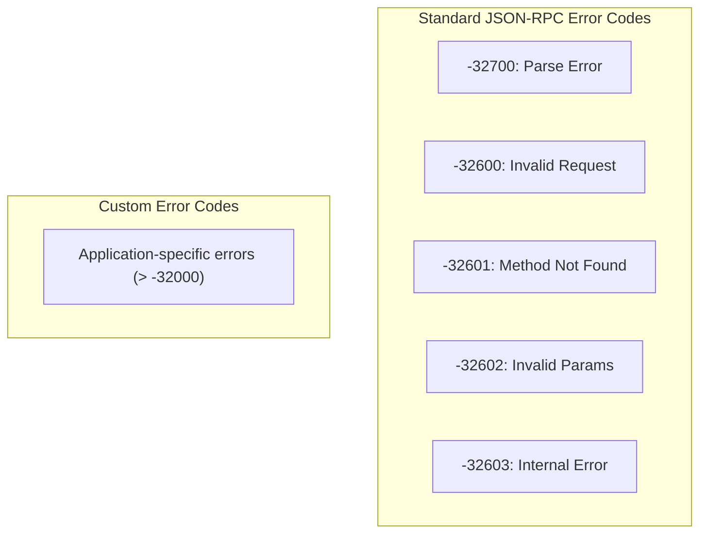

## 7. Putting It All Together: Complete MCP System

Now let's see how all these LEGO pieces fit together to create a complete MCP system.

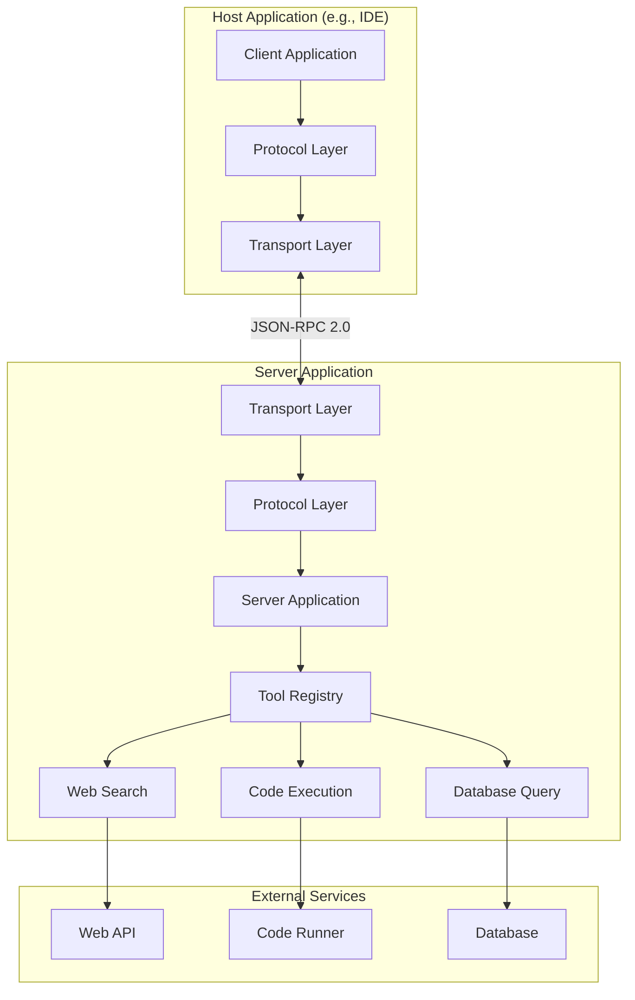

## 8. Implementation Example: Building Your Own MCP System

Let's walk through a simple example of building an MCP system, step by step.

### Step 1: Create the Server
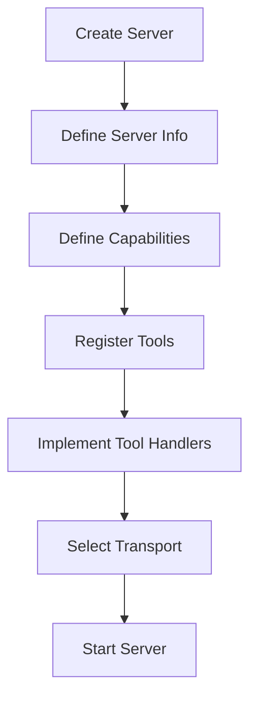

### Step 2: Create the Client
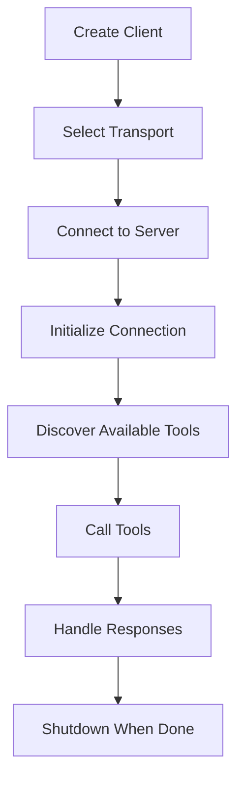

### Step 3: Complete Interaction Flow
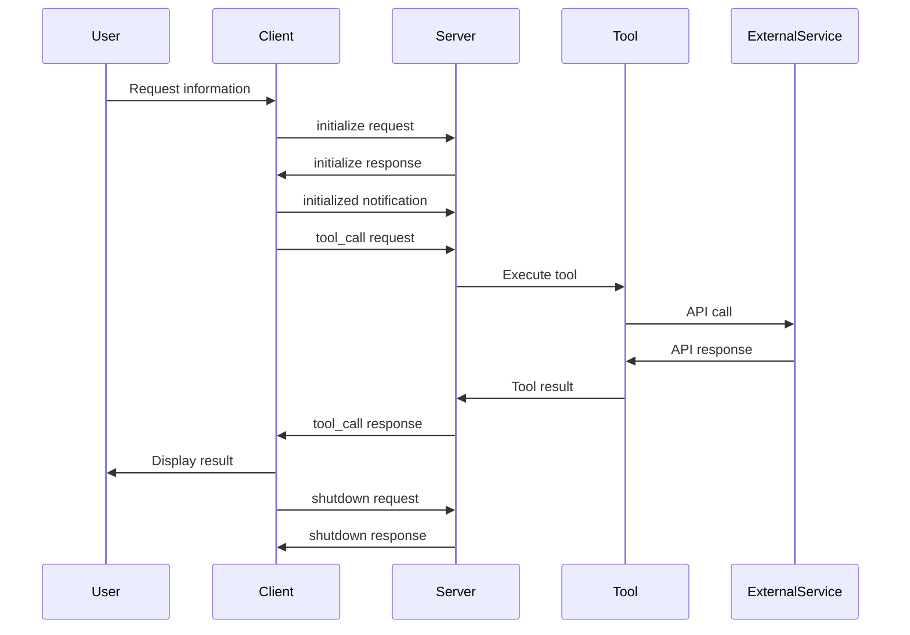

## 9. Security Considerations: Protecting Your LEGO Tower

Security in MCP is like making sure your LEGO tower is stable and protected.

```mermaid
graph TD
    Security[Security Considerations] --> Transport[Transport Security]
    Security --> Authentication[Authentication]
    Security --> Authorization[Authorization]
    Security --> Validation[Input Validation]
    Security --> ResourceProtection[Resource Protection]
    
    Transport --> TLS[Use TLS for Remote]
    Transport --> ValidateOrigin[Validate Connection Origins]
    
    Authentication --> ImplementAuth[Implement Authentication]
    Authentication --> SecureTokens[Secure Token Handling]
    
    Authorization --> AccessControl[Implement Access Controls]
    Authorization --> ResourcePermissions[Resource Permissions]
    
    Validation --> ValidateMessages[Validate All Messages]
    Validation --> SanitizeInputs[Sanitize Inputs]
    Validation --> SizeLimits[Message Size Limits]
    
    ResourceProtection --> RateLimiting[Rate Limiting]
    ResourceProtection --> Monitoring[Resource Monitoring]
    ResourceProtection --> Timeouts[Implement Timeouts]
```

## 10. Debugging and Monitoring: Maintaining Your LEGO Tower

Debugging and monitoring in MCP is like making sure your LEGO tower stays in good shape.

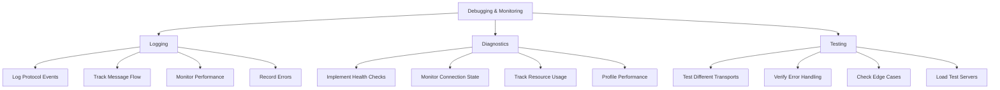

## Conclusion

The Model Context Protocol provides a flexible, standardized way for AI assistants to communicate with tools and services. By understanding the building blocks of MCP - from the transport layer to message formats to the connection lifecycle - you can build powerful, interoperable AI systems.

Just like building with LEGO, MCP allows you to create complex structures from simple, well-defined pieces that fit together in predictable ways. This modularity and standardization enable innovation while ensuring compatibility across different implementations.

## References

- [MCP Core Architecture](https://modelcontextprotocol.io/docs/concepts/architecture)
- [MCP Transports](https://modelcontextprotocol.io/docs/concepts/transports) 